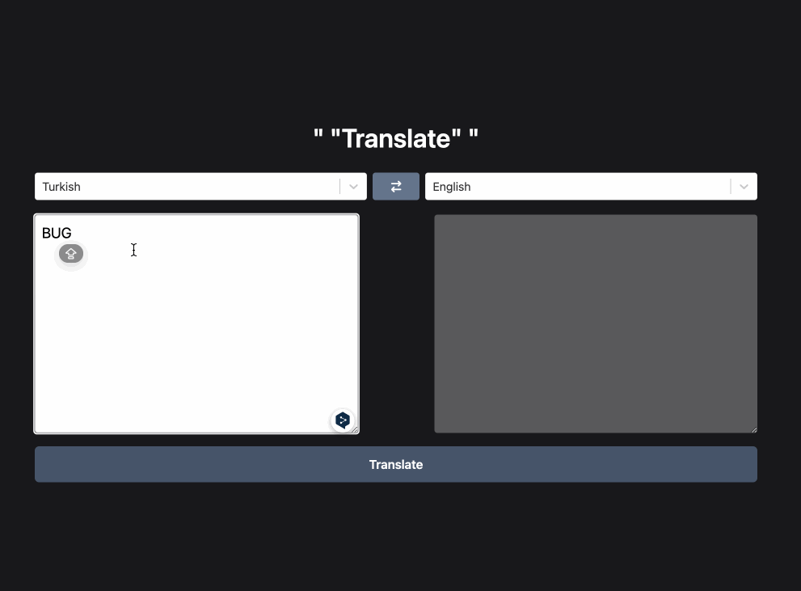

<h1>Translate App</h1>

    This project was developed using Redux Toolkit Thunk. Clean and understandable code was achieved by using the Thunk method. With the createAsyncThunk and extraReducers codes of the Thunk method, data is sent to the store and the Thunk actions' states of "pending", "rejected", and "fulfilled" are managed.

<h2> Screenshot </h2>

# Library

- axios
- @reduxjs/toolkit
- react-redux
- react-select
- tailwind
